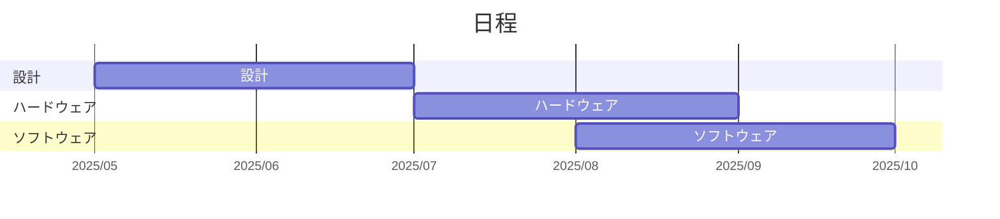
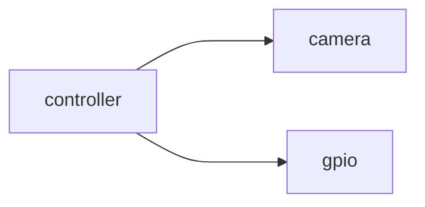
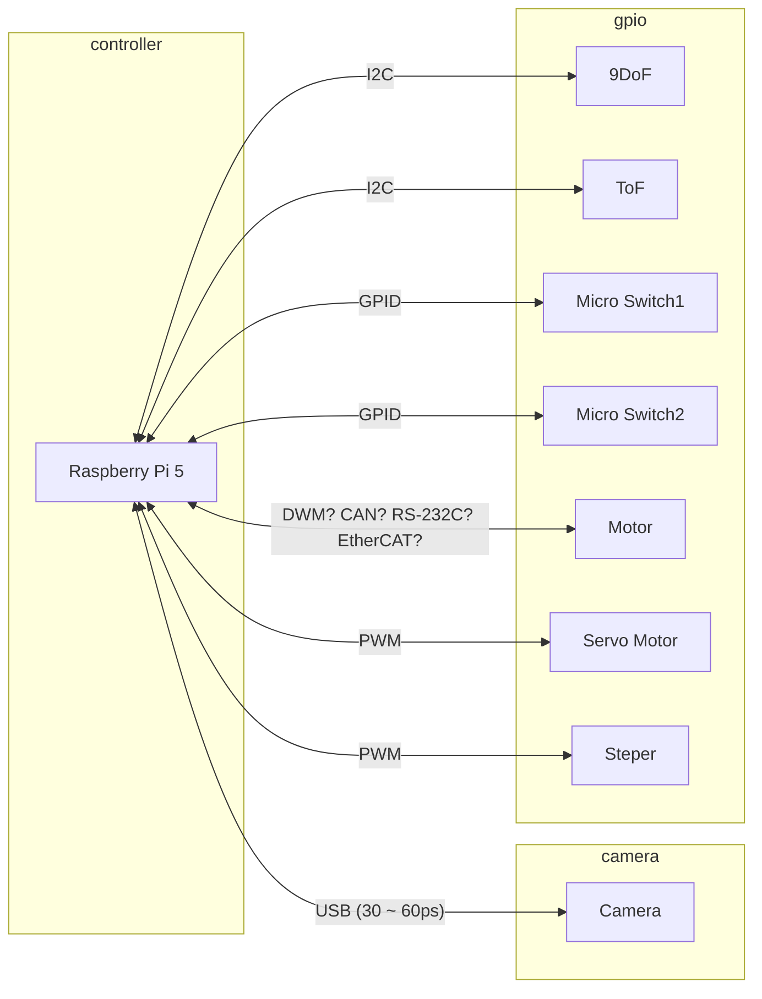

# breaking2

breaking2のロボットに関するコードを書き連らねたレポジトリです。

## スケジュール

```mermaid
gantt
    title 日程
    dateFormat YYYY-MM
    axisFormat %Y/%m
    section 設計
        設計 :2025-05, 2M
    section ハードウェア
        ハードウェア : 2025-07, 2M
    section ソフトウェア
        ソフトウェア : 2025-08, 2M
```

## crateの依存関係

```mermaid
flowchart LR
    controller["controller"] ---> camera["camera"]
    controller["controller"] ---> gpio["gpio"]
```

## 構成

```mermaid
flowchart LR
    subgraph controller
        raspberry["Raspberry Pi 5"]
    end
    subgraph camera
        cam["Camera"]
    end
    subgraph gpio
        dofs["9DoF"]
        tof["ToF"]
        switch1["Micro Switch1"]
        switch2["Micro Switch2"]
        motor["Motor"]
        servo["Servo Motor"]
        steper["Steper"]
    end
    raspberry["Raspberry Pi 5"] <-- "USB (30 ~ 60ps)" --> cam["Camera"]
    raspberry["Raspberry Pi 5"] <-- "I2C" --> dofs["9DoF"]
    raspberry["Raspberry Pi 5"] <-- "I2C" --> tof["ToF"]
    raspberry["Raspberry Pi 5"] <-- "GPID" --> switch1["Micro Switch1"]
    raspberry["Raspberry Pi 5"] <-- "GPID" --> switch2["Micro Switch2"]
    raspberry["Raspberry Pi 5"] <-- "DWM? CAN? RS-232C? EtherCAT?" --> motor["Motor"]
    raspberry["Raspberry Pi 5"] <-- PWM --> servo["Servo Motor"]
    raspberry["Raspberry Pi 5"] <-- PWM --> steper["Steper"]
```
